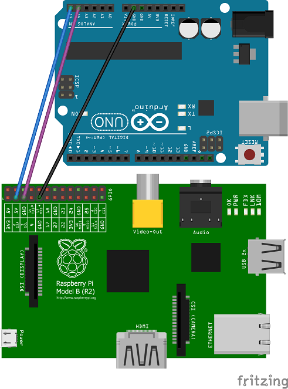

# Arduino I2C Raspberry Pi

Communication example between arduino and RPi with JSON, avoiding the 32 byte limitation of I2C. RPi acts as master, arduino as slave, and the communication is made through several request:

1. RPi asks for data length to arduino.
2. Arduino answers with the JSON length.
3. RPi gets the data in 32 byte requests.

RPi script is written in python, and uses the [smbus2](https://github.com/kplindegaard/smbus2) library to abstract from communication. Arduino sketch is based on this fantastic [post](https://www.luisllamas.es/arduino-i2c-json/). Software dependencies:

Arduino sketch:

* [ArduinoJson.h](https://arduinojson.org/)
* [Wire.h](https://www.arduino.cc/en/Reference/Wire)

Raspberry pi script:

* [smbus2](https://github.com/kplindegaard/smbus2)

## I2C

Use `i2cdetect -y 1` to search the adress device of your arduino. Maybe you will have to enable before the I2C kernel module with `raspi-config`.

## Code example

### Arduino

```c++
void receiveEvent(int nBytes) {
    while (Wire.available()) {
        request = (char) Wire.read();
    }
}

void requestEvent() {

    if (request == ASK_FOR_LENGTH) {
        Wire.write(json.length());
        requestIndex = 0;
    }

    if (request == ASK_FOR_DATA) {
        if (requestIndex < (json.length() / 32)) {
            Wire.write(json.c_str() + requestIndex * I2C_LENGTH_LIMIT, I2C_LENGTH_LIMIT);
            requestIndex++;
        }
        else {
            Wire.write(json.c_str() + requestIndex * I2C_LENGTH_LIMIT, json.length() % I2C_LENGTH_LIMIT);
            requestIndex = 0;
        }
    }
}
```

### Raspberry Pi

```python
with SMBus(1) as bus:

    time.sleep(SLEEP_TIME)

    # Ask for length response
    write = i2c_msg.write(I2C_SLAVE_ADDR, [ASK_FOR_LENGTH])
    bus.i2c_rdwr(write)

    time.sleep(SLEEP_TIME)

    # Answer
    read = i2c_msg.read(I2C_SLAVE_ADDR, 1)
    bus.i2c_rdwr(read)
    responseLength = list(read)[0]

    time.sleep(SLEEP_TIME)

    # Ask for data reponse
    write = i2c_msg.write(I2C_SLAVE_ADDR, [ASK_FOR_DATA])
    bus.i2c_rdwr(write)

    time.sleep(SLEEP_TIME)

    response = str()

    # Answer: Iterate over I2C_LENGTH_LIMIT bytes blocks, plus last [0,I2C_LENGTH_LIMIT] block
    for responseIndex in range(0, (responseLength // I2C_LENGTH_LIMIT) + 1, 1):
        read = i2c_msg.read(I2C_SLAVE_ADDR, I2C_LENGTH_LIMIT if (responseIndex != (responseLength // I2C_LENGTH_LIMIT)) else (responseLength % I2C_LENGTH_LIMIT))
        bus.i2c_rdwr(read)
        response +=  "".join([chr(i) for i in list(read)])

    print("Length: {0}".format(responseLength))
    print("Response: {0}".format(response))
```

## Wiring diagram


